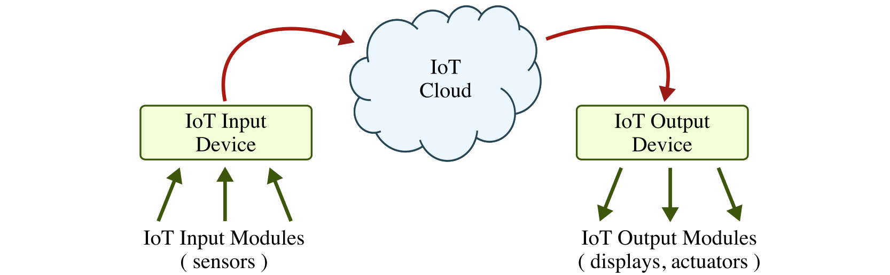
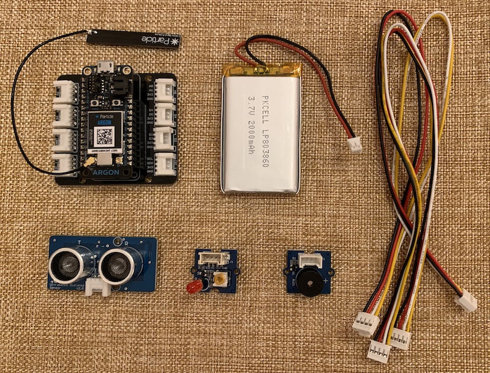
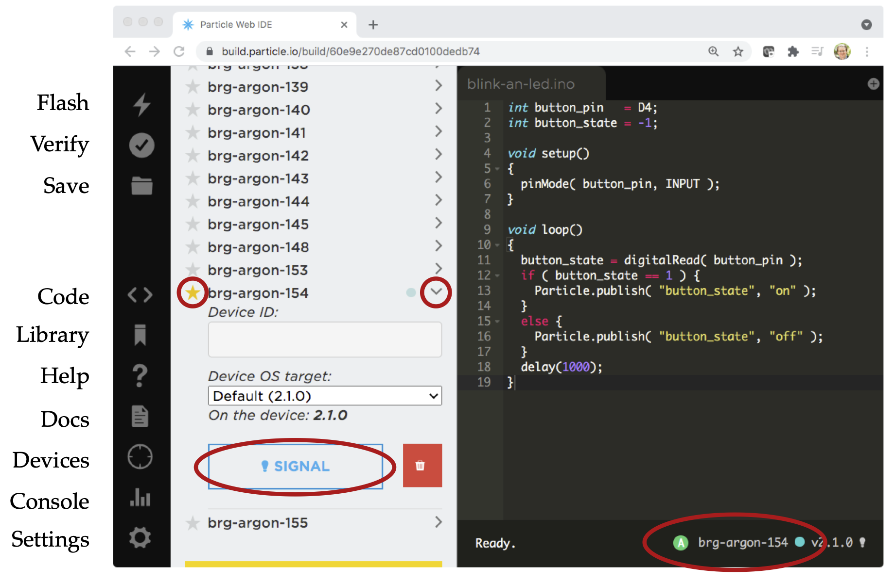

ENGRG 1050: Computer Engineering Mini-Lab
==========================================================================

 - Author: Christopher Batten
 - Date: October 31, 2022
 - URL: https://cornell-brg.github.io/engrg1050-2022-mini-lab

**Table of Contents**

 - Introduction
 - Part 1. Blinking an LED
 - Part 2. Using an Ultrasonic Rangefinder to Turn On LED
 - Part 3a. Using an Ultrasonic Rangefinder to Send IoT Message
 - Part 3b. Using an IoT Message to Turn on LED
 - Part 4. Putting Together the IoT System

Introduction
--------------------------------------------------------------------------

The field of computer engineering is at the interface between hardware
and software and seeks to balance the tension between application
requirements and technology constraints. This lab includes four parts
that should enable you to appreciate how hardware and software come
together to create a complete Internet-of-Things (IoT) system. The
following figure illustrates the high-level template such an IoT system.



Each IoT system is comprised of an IoT input device, IoT cloud, and IoT
output device. The IoT input device for this lab will include an
ultrasonic rangefinder and a Particle Argon board which will monitor the
sensor and communicate to the IoT cloud. The IoT output device for this
lab will include an LED and a Particle Argon board which will listen for
messages from the IoT cloud to indicate when it should turn on the LED.
The IoT cloud will be the Particle Cloud which can be seamlessly
integrated with the Particle Argon boards.

The final IoT system will work as follows: (1) the IoT input device will
monitor the environment for motion, and when it senses some kind of
motion it will send a message to the IoT cloud; (2) the IoT cloud will
relay this message to the IoT output device; and (3) the IoT output
device will trigger the LED to turn on. This IoT system is a simple
example of emerging "smart homes" where various input and devices work
together through the cloud to automate daily tasks and (hopefully)
improve the overall quality of our lives.

We will use an incremental process to building this IoT system. First, we
will divide each group of four students into two sub-groups with two
students each. One sub-group will focus on building the IoT input device
and the other sub-group will focus on building the IoT output device.
Each sub-group will start by just building a very basic
non-internet-connected device that uses an LED and the ultrasonic
rangefinder. The sub-groups will then experiment with either connecting
the input (i.e., ultrasonic rangefinder) or the output (i.e., LED) to the
cloud. Then the sub-groups will come together to combine the IoT input
device with the IoT output device to create the complete IoT system.

Part 0: Using the Particle IDE
--------------------------------------------------------------------------

Take a look at the materials on the lab bench which you will be using to
complete the lab. Make sure you can identify all of the materials before
continuing.



 - Particle Argon board
 - LiPo battery
 - LED output module
 - Buzzer output module
 - Ultrasonic rangefinder input module
 - Four-wire cables
 - Enclosure

Take a closer look at the Particle Argon board. Notice that there are
eight white connectors that can be used to connect the input and output
modules. There is an LED on top of the Particle Argon that shows the
status of the device. It should be breathing a calming cyan to indicate
that the board is connected to the cloud and operating normally.

We will be using the web-based Particle IDE to program your Particle
Argon. Go to this link on your laptop:

 - https://build.particle.io

You should not create a new account. You should login with your group
username and password. The following figure labels the key icons on the
left-hand side of the Particle development environment:



 - *Flash:* Compiles and flashes the current code to the selected device
 - *Verify:* Compiles without flashing the current code
 - *Save:* Saves the current code
 - *Code:* Shows a list of available programs
 - *Library:* Explore libraries
 - *Help:* Does not work for our Particle Argon
 - *Docs:* Brings you to the Particle documentation site
 - *Devices:* Shows a list of all devices
 - *Console:* Brings you to the Particle console for monitoring the IoT cloud
 - *Settings:* Log out

The most important icon is the flash (lightning) icon in the upper-left
hand corner. Clicking this icon will cause the Particle IDE to compile
your program into machine instructions and then to upload the resulting
machine instructions to the Particle Argon for execution. The above
figure illustrates what happens when you click on the devices icon. Note
that you must select your specific device by clicking the little star
next the device that matches your device number. You can always look at
the bottom right-hand corner to verify that you are working on your
specific device. You can click the little > to reveal the signal button.
Clicking this button will cause your Particle Argon to blink rainbow
colors which is a great way to confirm that your Particle Argon is
connected to the internet and working.

_Sign-Off Milestone:_ Signal your device and have an instructor verify
that things are working correctly.

Part 1: Blinking an LED
--------------------------------------------------------------------------

In this part, we will start by blinking the LED output module. An LED is
a "light emitting diode". It is a simple circuit component which lights
up when current flows through it. Connect the LED output module to the D4
pin using using one of the four-wire cables. Now let's look at the
software for this first part:

```c
// Global constants for pin assignments

int led_pin = D4;

// The setup routine runs once when you press reset

void setup()
{
  // Configure led_pin to be a digital output
  pinMode( led_pin, OUTPUT );
}

// The loop routine runs over and over again

void loop()
{
  // Turn on the LED
  digitalWrite( led_pin, LOW );

  // Wait one second
  delay(1000);

  // Turn off the LED
  digitalWrite( led_pin, HIGH );

  // Wait one second
  delay(1000);
}
```

Before continuing, we will try and understand each line of the program. A
program consists of a sequence of statements; these statements are
executed one at a time by the microcontroller to ultimately execute the
program. An Particle program can be divided into three sections. The
first section is where we create global names for pin assignments. The
second section is the `setup` routine, and the third section is the
`loop` routine. The statements in the `setup` routine execute only once
at the very beginning of the program. The statements in the `loop`
routine execute repeatedly over and over again.

The `int led_pin = D4` statement is a variable assignment. It specifies
that the variable named `led_pin` should be assigned the value `D4`. From
then on, whenever we use the name `led_pin` it will be interpreted as the
value `D4`. We also need to specify the "type" of this variable. In this
case, the type is `int` which indicates that this variable will store
integer values. Effectively, we are saying that the LED input module is
connected to digital input `D4` on the Particle Argon. The `pinMode(
led_pin, OUTPUT )` statement is a call to a routine which tells the
Particle Argon that pin number `led_pin` (i.e., pin number `D4`) should
be configured as a digital output pin.

The `digitalWrite( led_pin, LOW )` statement is a call to a routine which
tells the Particle Argon to write either a logic high or a logic low
value to the pin number `led_pin`. The `delay(1000)` statement is a call
to a routine which delays execution for one second (the argument to the
routine is specified in milliseconds). These two statements turn on the
LED and wait one second. The next statements turn the LED back off and
wait another second. Since the statements in the loop execute over and
over, this program effectively turns the LED on, then off, then on, then
off, etc.

Type this program into the Particle software development environment.
Click the code icon. The input group should edit the `engrg1050-input`
program, and the output group should edit the `engrg1050-output` program.
Once you have entered your code, then click on the flash button to
download your program to Particle Argon. Be patient as this can take a
few seconds. Verify that the LED blinks appropriately. Feel free to
experiment with different delays to vary the blink rate.

_Sign-Off Milestone:_ Once you have the LED blinking, have an instructor
verify that things are working correctly.

Part 2. Using an Ultrasonic Rangefinder to Turn On LED
--------------------------------------------------------------------------

In this part, we will only turn on the LED when the ultrasonic
rangefinder detects that something is closer than a certain threshold.
Connect the ultrasonic rangefinder input module to the A4 pin using using
one of the four-wire cables. Now let's look at the software for this
second part:

```c

#include <Grove-Ultrasonic-Ranger.h>

int ranger_pin = A4;
int led_pin    = D4;

Ultrasonic range_sensor( ranger_pin );

void setup()
{
  pinMode( led_pin, OUTPUT );
}

void loop() {
  int ranger_cm = range_sensor.MeasureInCentimeters();

  if ( ranger_cm < 20 ) {
    digitalWrite( led_pin, HIGH );
  }
  else {
    digitalWrite( led_pin, LOW );
  }

  delay( 1000 );
}
```

Notice that we are configuring another pin, `ranger_pin`, which is then
used when constructing the `Ultrasonic` class. In the `loop` routine, we
check if the range is less than a threshold, and if so we turn on the
LED. Test out your code, and try different thresholds.

_Sign-Off Milestone:_ Once you have the ultrasound ranger input module
controlling the LED output module, have an instructor verify that things
are working correctly.

Part 3a. Using an Ultrasonic Rangefinder to Send IoT Message
--------------------------------------------------------------------------

This part is for the IoT input sub-group. If you are in an IoT output
sub-group then you should work on Part 3b. Go ahead and disconnect the
LED output module. Leave the ultrasonic rangefinder input module
connected to the Particle Argon. In this part, you will work on sending
an IoT message to the cloud when the ultrasonic rangefinder detects
something is closer than a certain threshold. Modify the code from Part 2
to use the `Particle.publish` function to send an IoT message like this:

```c

#include <Grove-Ultrasonic-Ranger.h>

int ranger_pin = A4;

Ultrasonic range_sensor( ranger_pin );

void setup()
{ }

void loop() {
  ranger_cm = range_sensor.MeasureInCentimeters();

  if ( ranger_cm < 20 ) {
    Particle.publish( "alarm", "on" );
  }
  else {
    Particle.publish( "alarm", "off" );
  }

  delay( 1000 );
}
```

The `Particle.publish` function will send a message named "alarm" and the
message data is either "on" or "off" depending on whether we want to the
alarm on the output device to be on or off. You can verify this is
working by watching the console. Click on the console button and you
should see a "alarm/on" event show up every time you trigger the
ultrasonic rangefinder.

_Sign-Off Milestone:_ Once you have verified that your IoT input device
is able to send messages to the IoT cloud, show an instructor by using
the console.

Part 3b. Using an IoT Message to Turn on LED
--------------------------------------------------------------------------

This part is for the IoT output sub-group. If you are in an IoT input
sub-group then you should work on Part 3a. Go ahead and disconnect the
ultrasonic rangefinder input module. Leave the LED output module
connected to the Particle Argon. In this part, you will work on receiving
an IoT message to turn on and off the LED output module. Modify the code
from Part 2 to use the `Particle.subscribe` function to receive an IoT
message like this:

```c

int led_pin = D4;

void receive_msg( const char* event, const char* data )
{
  if ( strcmp( data, "on" ) == 0 ) {
    digitalWrite( led_pin, HIGH );
  }
  else {
    digitalWrite( led_pin, LOW );
  }
}

void setup()
{
  pinMode( led_pin, OUTPUT );
  Particle.subscribe( "alarm", receive_msg );
}

void loop()
{ }
```

The `Particle.subscribe` function says to call the `receive_msg` function
whenever the Particle Argon receives an "alarm" message. In the
`receive_msg` function, we check to see if the message data is either
"on" or "off" and turn on or off the LED appropriately.

_Sign-Off Milestone:_ Before downloading your code to the Particle Argon
board, have an instructor verify it is correct.

Part 5. Putting Together the IoT System
--------------------------------------------------------------------------

We are now ready to put together the IoT input device and the IoT output
device into a complete IoT system! All we need to do is have the IoT
output sub-group download their code to their Particle Argon board. Try
triggering the ultrasonic rangefinder on the IoT input device, use the
console to see that the message was sent into the IoT cloud, and verify
that the LED on the IoT output device goes on. Once this all works, it is
now time to polish up the IoT system a bit.

Consider adding an audible alarm using the buzzer. You can connect
the buzzer to the D2 pin of the IoT output device. Use `pinMode` to
configure the buzzer as an output in the `setup` function, and then write
the buzzer just like you do the LED. Use HIGH to turn the buzzer on, and
LOW to turn the buzzer off.

Put your IoT input and output devices into the small enclosures. Use some
blue tape to attache the input/output modules to your device. Position
the ultrasonic rangefinder on the side of the enclosure.

Now place your IoT input device in the hallway to see if you can detect
students passing outside!

_Sign-Off Milestone:_ Have an instructor verify the whole system works.

